#### * These authors contributed equally

# Abstract

The BioAI Hackathon at the Centre of New Technologies at the University of Warsaw convened 43 international researchers to collaboratively explore artificial intelligence (AI) approaches for solving complex challenges in computational biology. Nine interdisciplinary and multi-institutional teams addressed the following problems: disease-gene prioritization, microbiome analysis, drug-protein interactions, alternative splicing prediction, chromatin architecture study and toxicological profiling. Using cutting-edge tools such as graph neural networks (GNNs), large language models (LLMs), and multi-omics integration frameworks, participants developed scalable and reproducible analytical pipelines. The results include a disease gene prioritization framework using GNNs, a microbiome dynamics analysis for poultry health prediction and the construction of chromatin structure-aware regulatory networks leveraging Hi-C and scRNA-seq data. All projects follow the open science principles and display translational potential. This hackathon underscores the transformative role of AI in biomedicine and the value of collaborative, time-bounded innovation for accelerating discovery in life sciences.

# Introduction

Recent advances in genomics, transcriptomics, epigenetics and systems biology have enabled an unprecedented capacity to collect and analyze biological data. These high-throughput technologies generate vast datasets that hold the key to understanding human health and disease. However, the volume, complexity, and heterogeneity of biomedical data pose significant challenges. To address them, artificial intelligence (AI), particularly machine learning (ML) and deep learning (DL) algorithms, have become increasingly useful in extracting meaningful biological insights. During the BioAI Hackathon at the University of Warsaw, participants explored novel AI-based solutions, including graph neural networks and large language models, for the following challenges: disease-gene prioritization, microbiome dynamics analysis, drug discovery for rare disease, study of splicing regulation, epigenomics data harmonization, investigation of chromatin reorganization and toxicological profiling. All projects are publicly available on GitHub: https://github.com/SFGLab 

## Code Availability

Team 1: Prioritizing disease-associated genes using graph neural networks: https://github.com/SFGLab/Team1_Gene_Prioritization_GNN 

Team 2: AI-Driven Microbiome Analysis for Predicting Poultry Health and Performance: https://github.com/SFGLab/Team2_AI_Microbiome_Poultry

Team 4: AI-Driven Prediction of Drug-Protein Interactions for Rare Diseases: https://github.com/SFGLab/Team4_AI_Drug_Targets_Rare_Diseases

Team 5: Phasing structural variants using phased aligned data: https://github.com/SFGLab/SvPhaser

Team 6: Leveraging LLMs for alternative splicing studies: https://github.com/SFGLab/Team6_LLM_Splicing_Studies

Team 7: Harmonization and imputation of epigenomics data – exposome: https://github.com/SFGLab/EpiXposome

Team 8: Discovering cell cycle phase-specific chromatin conformation changes based on single cell Hi-C and multi-omics data: https://github.com/SFGLab/Team8_PhaseSpecific_Chromatin_Changes

Team 9: Advanced Modeling of Toxicological Profiles: https://github.com/SFGLab/Team9_Toxicological_Profiles

Team 10: Developing graph neural networks for gene regulation discovery: https://github.com/SFGLab/GNN4GRN-3D 

## Team 1: Prioritizing disease-associated genes using graph neural networks

Medical genomics aims at finding genes related to diseases. Experimental studies are often laborious and expensive, therefore bioinformatics methods are useful in the prioritization of candidate disease-associated genes [@Shi2020-ll]. Recent bioinformatics methods based on machine learning, such as graph neural networks (GNNs), are increasingly popular [@Ata2021-hq; @Zitnik2024-gc]. GNNs are expected to offer improved performance by recognizing complex network patterns and leveraging additional biological information. The increasing number of GNN-based methods requires further understanding of how they compare to the state-of-the-art network propagation methods such as Random Walk with Restart [@Baptista2022-xb; @Kohler2008-vj] or PageRank [@Page1999-pi; @Chung2010-xy]. Compared to network propagation, the usability of GNNs is often limited due to high computational requirements and issues with interpretability. During the hackathon, we aimed at comparing the performance of graph neural networks with network propagation methods [@Cowen2017-ku]. As for the use case, we focused on genes involved in hereditary ataxia, a group of rare neurodegenerative disorders characterized by progressive loss of coordination and balance [@Perlman1993-bp; @Park2022-lb].

## Team 2: AI-Driven Microbiome Analysis for Predicting Poultry Health and Performance

The gut microbiome plays a critical role in shaping poultry growth, nutrient absorption, immune function, and disease resistance, making it a promising target for data-driven performance optimization strategies in livestock production [@Kogut2016-rg]. Traditional microbiome analyses, however, often fall short in capturing the high-dimensional complexity and dynamic variability of microbial ecosystems. To address this, Team 2 developed an AI-powered pipeline that integrates next-generation sequencing data with advanced machine learning models to predict poultry health and performance outcomes. By leveraging both 16S rRNA amplicon and shotgun metagenomic datasets, the approach aims to uncover microbial biomarkers and compositional patterns linked to productive traits, laying the groundwork for precision microbiome engineering in poultry farming [@Gilbert2016-mp].

## Team 4: RARExDrug: AI-Driven Prediction of Drug-Protein Interactions for Rare Diseases

RARExDrug aims to bridge the huge disparity between millions of existing drug-like molecules and the lack of treatment in nine-tenth of rare diseases. By leveraging existing drug-protein interaction databases and rare disease-protein databases, we predicted novel drug-protein binding interactions. Furthermore, we employed ProteinBERT, a state-of-the-art transformer-based protein language model pretrained on ~106 million sequences from UniRef90 using a masked language modeling (MLM) technique. Remarkably, this model uses a dual-scale embedding architecture—integrating residue-level embeddings and sequence-level embeddings—with global-attention layers of linear complexity to appropriately capture both local and global contextual information across entire protein sequences, enabling efficient and scalable modeling of protein function and interactions.. This enabled our prototype machine learning model to process extremely long protein sequences—which are often infeasible for standard models—and extract biologically meaningful residue-level representations. We applied this framework to large-scale datasets using the rare disease cystic fibrosis as a test case to explore functional protein-ligand interactions. Additionally, we externally validated the obtained potential drug candidate results by comparing the structure of identified ligands with existing experimentally validated therapeutic alternatives. The abundance of well-curated ClinVar data on pathogenic variants of Cystic Fibrosis and its clear genotype-phenotype correlation makes it advantageous for training this model. Ultimately, RARExDrug promises to accelerate drug discovery for rare diseases, reducing both timeline and cost.

## Team 5: Phasing structural variants using phased aligned data

Understanding genetic variation is fundamental to deciphering genome function and disease. Haplotypes, sets of co-inherited DNA variations, are crucial for elucidating gene function, disease susceptibility, and population genetics. Concurrently, Structural Variants (SVs)—large-scale genomic alterations—significantly contribute to genetic diversity and are implicated in numerous human diseases. However, determining the haplotype phase of SVs, assigning each to its parental chromosome, is substantially more challenging than for smaller variants like SNPs, largely due to SV size and complexity. While SNP phasing methods are mature and modern sequencing can provide phased alignments, a critical gap exists in accurately transferring this phase information to co-located SVs. Phased SVs are vital for identifying compound heterozygosity and understanding allele-specific effects, thereby improving genomic studies. This project aims to bridge this gap by developing a novel method that integrates information from pre-phased SNPs and phased read alignments to accurately estimate SV haplotypes, offering a valuable contribution to the genomics toolkit.

## Team 6: Leveraging LLMs for alternative splicing studies

Alternative splicing (AS) is a vital post-transcriptional mechanism in eukaryotic gene regulation that enables a single gene to produce multiple mRNA transcripts and protein isoforms. This biological process expands the functional capacity of the genome, playing a critical role in tissue-specific gene expression, cellular identity, and developmental processes. However, dysregulation of AS has been strongly linked to cancer progression, contributing to key hallmarks such as uncontrolled proliferation, resistance to apoptosis, angiogenesis, and metastasis. Given its complexity and relevance, accurate detection and prediction of splicing events—especially tumor-specific ones—are crucial for understanding disease mechanisms and identifying potential biomarkers or therapeutic targets. This project aims to leverage LLMs in the process of splicing, thereby increasing the efficiency and accuracy (as seen in Fig. Team 6-1).

## Team 7: Harmonization and imputation of epigenomics data – exposome

The exposome, a term coined to describe the totality of environmental exposures from conception onwards, is increasingly recognized for its role in shaping health outcomes, including the development of chronic diseases and cancers [@Vineis2022-ul]. Among the various factors that contribute to the exposome, epigenetic modifications such as DNA methylation and microRNA (miRNA) expression have been shown to be particularly influential in regulating gene expression without altering the DNA sequence itself [@Danieli2024-gp]. The interaction between the exposome and these epigenetic markers is a burgeoning area of research, with previous studies suggesting that environmental factors can induce epigenetic changes that may lead to disease susceptibility [@Ogunjobi2024-pc]. In the face of growing evidence linking environmental exposures to chronic diseases and cancers, our project aims to leverage advanced machine learning techniques, specifically bidirectional recurrent neural networks (BiRNNs), to explore the intricate relationship between the exposome and epigenomics. By integrating diverse datasets from different, we seek to uncover how environmental variables influence epigenetic markers, potentially offering novel insights into disease development and progression.

## Team 8: Discovering cell cycle phase-specific chromatin conformation changes based on single cell Hi-C and multi-omics data

Chromatin undergoes dynamic structural reorganisation which may drive chromatin organization throughout the cell cycle. Our project aims to comprehensively integrate multi-omics datasets—including gene expression, chromatin accessibility, and contact maps—to advance the understanding of cell cycle phase-specific chromatin dynamics. Coupled with 3D genome modeling, our approach seeks to uncover novel and distinct chromatin conformational changes along the trajectory of cell cycle progression and other genomic processes such as cellular maturation. We employ state-of-the-art 3D modeling techniques that incorporate temporal information from the cell cycle, alongside cutting-edge methods for multi-omics integration, clustering, and pattern recognition. This combined strategy is designed to reveal common principles and patterns underlying chromatin structural organization within the cell nucleus.

## Team 9: Advanced Modeling of Toxicological Profiles

Estrogen related receptors (ERRs) are one of the first orphan nuclear receptors identified [@Aubert2013-ha]. ERRs are required for high-energy production in response to the environmental and physiological challenges. They play an important role in the control of cellular energy, including mitochondrial biogenesis, gluconeogenesis, and oxidative phosphorylation [@Aubert2013-ha; @Audet-Walsh2015-ci], with signaling implicated in metabolic disorders like type 2 diabetes [@Audet-Walsh2015-ci], with EER-alpha (subfamily of EERs) identified as an adverse marker for breast cancer progression [@Huang2016-av].
Screening and identifying environmental compounds that perturb the EER signaling pathways could provide information for potential preventive measures in treating the mentioned metabolic diseases [@Aubert2013-ha]. Predicting their activity continuously allows for a quantitative assessment of receptor activation or inhibition, reflecting real biological responses more accurately than binary (toxic/nontoxic) labels, additionally allowing for information on dose-response that is not present in binary toxicity prediction.

## Team 10: Developing graph neural networks for gene regulation discovery

The Gene regulatory networks (GRNs) play a pivotal role in revealing the extended regulatory relationship between genes and transcription factors, which forms the basis of describing complex biological processes and modes of gene regulation for the therapy of human diseases [@Pratapa2020-sk]. With revolutions in the single-cell RNA sequencing (scRNA-Seq) and chromosome conformation capture technologies, we can perform the simultaneous analysis of gene expression and 3D chromatin [@Cremer2019-hf; @Rao2014-qs; @Zheng2019-gh]. Graph neural networks (GNNs) provided natural architecture for modeling network-like data with the ability to integrate various additional features and choose between a range of architecture variants [@Zhou2020-ca], most notably, the Graph Attention Networks (GATs), [@Velickovic2017-dh]. multilayered genomic data types from cutting-edge omics technologies . The aim of this project is to provide an extensible framework for training GNN models on custom datasets, adding the ability to adjust and provide custom features by the user without the need to rewrite training code. We build on previous approaches [@Paul2024-np] in particular by incorporating chromosome conformation capture data (Hi-C), to improve the GRN predictions from scRNA-Seq to bridge graph-based machine learning and 3D Genomics.

# Methods

## Team 1: Prioritizing disease-associated genes using graph neural networks	
We developed a framework to compare graph neural networks with network propagation algorithms, with the overarching objective of discovering particular aspects of these methodologies governing network-based disease-gene prioritization. To do this, we gathered biological interaction networks and phenotypic datasets from public databases. The protein-protein interaction network was created using protein-protein interaction data from the BioGRID database [@Oughtred2021-du] (https://thebiogrid.org/) and Reactome [@Milacic2024-lu] (https://reactome.org/) that capture both direct biophysical interactions and functional pathway relationships. In addition, we encompassed tissue-specific gene expression data from the GTEx portal [@GTEx_Consortium2013-uo] (https://www.gtexportal.org/home/) (“cerebellum”) and genetic variant information from the AstraZeneca PheWAS portal [@Wang2021-vb] (https://azphewas.com/).
Disease-associated genes were extracted from the Human Phenotype Ontology databases (Human Phenotype Ontology) utilizing fifteen curated ataxia-related phenotypic descriptors spanning HP:0001251 through C0007758 (Table Team 1-1), accessed via Jackson Laboratory's standardized annotation framework, while secondary validation employed Genomics England's PanelApp curated hereditary ataxia panel comprising 185 genes to ensure clinical-grade gene-disease associations. Node feature engineering incorporated multi-dimensional biological evidence encompassing cerebellar-specific transcriptomic signatures, population-scale genetic variant statistics, and clinical phenotypic correlations to establish comprehensive gene characterization vectors that captured both molecular and clinical disease manifestations within the analytical framework.

Three software packages for disease-gene prioritization were evaluated: geneDRAGNN [@Altabaa2022-wz], XGDAG [@Mastropietro2023-pj] and Random Walk with Restart (as implemented in MultiXrank) [@Baptista2022-xb]. The geneDRAGNN framework employs transfer learning that leverages pretrained disease-agnostic representations and gene embeddings generated through Node2Vec dimensionality reduction creating 107-dimensional latent space representations capturing both local neighborhood topology and global network structural properties. A two-layer Simplified Graph Convolution architecture, implemented via PyTorch Geometric, facilitated efficient multi-hop feature propagation through cross-entropy optimization and Adam-based parameter updating. The XGDAG framework integrated Positive-Unlabeled learning with GraphSAGE inductive representation learning, that addresses potential network sparsity through negative sampling mitigation. Random Walk with Restart served as the state-of-the-art network propagation methodology, which employs iterative probabilistic diffusion with transition probability 0.85 and restart probability 0.15 from known disease seeds until it achieves a steady-state gene scoring distribution. Model performance was assessed through precision, recall, F1-score, and area-under-curve. We ensure the accordance of our project with the FAIR principles by a well-documented GitHub repository. The overall workflow is illustrated in Figure Team 1-1, showcasing the steps from data collection and preprocessing to model training and evaluation.

## Team 2: AI-Driven Microbiome Analysis for Predicting Poultry Health and Performance

To elucidate microbial determinants of poultry performance, we deployed a sophisticated artificial intelligence framework for predictive modeling of health and production phenotypes. The overarching objective was to discover robust microbial biomarkers governing growth performance, gut homeostasis, and disease resilience through the strategic application of machine learning architectures to curated public datasets.

Poultry microbiome datasets were systematically curated from the European Nucleotide Archive using BioProject identifiers, strategically incorporating both 16S rRNA amplicon sequencing and shotgun metagenomic data to capture taxonomic diversity and functional potential. A bespoke automated pipeline orchestrated through custom shell scripts streamlined data acquisition, quality assessment, adapter trimming via fastp, and integrated quality reporting through MultiQC. Raw sequencing data underwent rigorous preprocessing encompassing Phred score-based quality filtration, comprehensive adapter and primer excision, paired-end read assembly with stringent overlap criteria, and systematic chimera elimination to preserve sequence authenticity.

Taxonomic characterization leveraged a bifurcated analytical strategy tailored to sequencing modality. Shotgun metagenomic data underwent taxonomic deconvolution using Kraken2 against expansive reference databases, yielding hierarchical abundance matrices across taxonomic ranks. Conversely, 16S rRNA amplicon data were processed through the DADA2 pipeline for error correction, amplicon sequence variant resolution and enumeration, succeeded by taxonomic annotation using the SILVA reference database (silva_nr99_v138.1_wSpecies_train_set.fa.gz). Taxonomic profiles were consolidated at genus and species resolutions, with standardized CSV outputs integrated with phenotypic metadata to facilitate seamless analytical workflows.

Microbiome compositional data underwent sophisticated normalization protocols including relative abundance standardization to mitigate sequencing depth heterogeneity and judicious log-transformation to stabilize variance structures. The machine learning architecture incorporated intelligent feature curation to isolate discriminative taxonomic signatures, advanced dimensionality reduction to navigate high-dimensional taxonomic space, and strategic integration of microbial profiles with comprehensive phenotypic metadata encompassing growth kinetics and health biomarkers.

The analytical framework deployed multiple complementary approaches including unsupervised clustering algorithms to unveil latent microbiome archetypes with rigorous cluster optimization, supervised classification models engineered to predict discrete health outcomes, and sophisticated regression frameworks targeting continuous production metrics. Model robustness was validated through k-fold cross-validation, task-specific performance metrics, statistical hypothesis testing, and systematic benchmarking against established methodologies.

Visualization strategies encompassed taxonomic composition landscapes, principal coordinate analysis for community structure elucidation, model performance diagnostics, and biomarker significance hierarchies. The entire analytical ecosystem was architected with reproducibility imperatives through version-controlled development, exhaustive documentation protocols, standardized data interchange formats, and fully automated execution pipelines. Quality governance included systematic pipeline validation, protocol benchmarking against established standards, and comprehensive analytical checkpoints. This methodology represents a paradigmatic integration of cutting-edge bioinformatics with advanced machine learning, yielding actionable microbiome intelligence for precision poultry management. The complete pipeline is illustrated in Figure Team 2-1, outlining a modular workflow from data acquisition to model training.

## Team 4: RARExDrug: AI-Driven Prediction of Drug-Protein Interactions for Rare Diseases

BindingDB was selected as the primary dataset for predicting drug-protein interactions associated with rare diseases, leveraging its extensive repository of approximately 1.5 million protein-ligand interaction entries. This database was chosen for its accessibility, well-structured format containing SMILES strings for each ligand, and comprehensive integration of data from multiple authoritative sources including ChEMBL, patent databases, and peer-reviewed publications. A subset of 500,000 samples was systematically selected from BindingDB to establish the foundation for deep learning model training and evaluation.

To address potential bias and enhance model robustness, 250,000 negative samples were synthetically generated through strategic amino acid mutations in known binding proteins. Approximately 30% of amino acids were mutated while maintaining structural feasibility constraints, thereby creating realistic non-binding scenarios and preventing positively skewed interaction predictions. The resulting dataset comprised 750,000 samples, combining 500,000 positive binding events with 250,000 negative binding events, providing a balanced training environment for the classification model.

Raw protein sequences and ligand structures were transformed into machine-readable representations using state-of-the-art embedding techniques. ProteinBERT was employed to generate comprehensive protein embeddings that capture both local amino acid properties and global sequence-level information, while ChemBERTa was utilized to encode ligand molecular characteristics including functional groups, substructural motifs, and stereochemical features. These complementary embedding approaches ensured comprehensive molecular representation for downstream analysis.

The deep learning architecture was implemented using PyTorch, featuring a neural network specifically designed for binary classification of protein-ligand interactions. The input layer received concatenated protein and ligand embeddings, followed by rectified linear unit (ReLU) activation functions to introduce non-linearity and facilitate gradient propagation. Two hidden layers with ReLU activations enabled the model to capture complex, non-linear relationships within high-dimensional input spaces. The output layer consisted of a single node with sigmoid activation, generating probability scores between 0 and 1 representing binding likelihood.

The dataset was partitioned into training, validation, and test sets to ensure robust model evaluation. Binary cross-entropy loss function was implemented alongside the Adam optimizer, selected for its adaptive learning rate capabilities across diverse parameter landscapes. Training was conducted over 11 epochs with a batch size of 100 and sample size of 7,000. Model performance was primarily assessed using Area under the Receiver Operating Characteristic Curve (AUC-ROC), supplemented by confusion matrices and training versus validation loss plots for comprehensive performance analysis. Baseline comparisons against simpler models validated the architecture's effectiveness. Complete implementation code and configuration details are publicly available on GitHub to ensure methodological transparency and research reproducibility.

## Team 5: Phasing structural variants using phased aligned data

To achieve accurate haplotype assignment of structural variants in long-read sequencing data, this study implemented SvPhaser, a computational framework that leverages phased single nucleotide polymorphism information to assign structural variants to their respective parental chromosomes through integrated genomic evidence.

The workflow commenced with Binary Alignment Map files containing long-read sequences aligned to a reference genome. Initial variant calling proceeded through parallel tracks, with SNPs identified using Clair3 [@Zheng2022-uh] while structural variants were independently called using ConsensuSV-ONT [@Pietryga2025-he] to generate comprehensive unphased structural variant catalogs in VCF format. SNP phasing was accomplished through read-based methodologies, employing WhatsHaps [@Martin2023-iv] to generate phased SNP calls with established haplotype blocks.

The resulting phased SNP information enabled BAM file haplotagging, wherein individual sequencing reads were assigned haplotype-specific tags based on concordance with phased SNP haplotypes. WhatsHap's haplotag functionality annotated each read with HP tags indicating assignment to haplotype 1 or haplotype 2, creating comprehensively phased BAM files preserving read-level haplotype information.

The core structural variant phasing algorithm operated through systematic evaluation of read support evidence for each detected structural variant. For every variant, the methodology extracted supporting reads from phased BAM files, focusing exclusively on reads bearing HP tags indicating successful haplotype assignment. The algorithm implemented a hierarchical decision framework comprising conditional assessments to ensure robust phase assignment.

Primary evaluation required overlapping reads to possess valid haplotype tags, establishing prerequisites for phase transfer from SNPs to structural variants. The algorithm quantified supporting read evidence by enumerating reads tagged as haplotype 1 and haplotype 2 demonstrating structural variant support. A user-defined minimum read support threshold ensured statistical confidence in phase assignments, with variants receiving haplotype assignment only when supporting read counts exceeded this threshold.

Phase assignment followed majority-rule logic, wherein structural variants were assigned to haplotypes supported by preponderant tagged reads, provided minimum support criteria were satisfied. Cases exhibiting equal haplotype support meeting minimum thresholds were flagged as ambiguous, with homozygous variants potentially receiving dual assignment while heterozygous variants typically remained unphased.

Computational implementation employed chromosome-wise parallelization to optimize processing efficiency, with independent chromosome processing minimizing memory requirements and maximizing scalability. Quality control included systematic validation through diploid assembly comparison where available and assessment of phase consistency across neighboring variants. Final outputs comprised phased structural variant files in VCF format, annotated with genotype and phase set information using GT and PS fields indicating parental chromosome origin, enabling haplotype-resolved structural variant characterization for population genomics and medical genetics applications.

## Team 6: Leveraging LLMs for alternative splicing studies

To elucidate oncogenic splicing aberrations through computational intelligence, this study architected a sophisticated large language model framework that harnesses pre-trained genomic transformers for discriminative splice junction characterization. The methodology orchestrated comprehensive genomic datasets with cutting-edge deep learning architectures to unveil cryptic splicing signatures governing tumorigenesis.

Data curation encompassed premier genomic repositories including TCGA Pan-Cancer Atlas (Weinstein, J., C,et al) splicing compendiums, VastDB alternative splicing ontologies, and hg19 reference genome assemblies. The analytical pipeline commenced with systematic acquisition of tumor splicing event catalogs, extracting transcript architectures and corresponding splicing annotations from rigorously curated repositories. Low-confidence splicing events underwent stringent filtration based on Percent Spliced In statistical thresholds to preserve biologically meaningful splice junction events. Flanking DNA sequences surrounding identified splice sites were extracted from reference genomes and transformed through one-hot vectorization for numerical representation amenable to machine learning paradigms.

The experimental architecture deployed a binary classification schema leveraging two molecularly distinct sequence archetypes: tumor-associated neojunctions epitomizing aberrant splice architectures pathognomonic of malignant tissues, and canonical junctions representing physiological splicing events characteristic of homeostatic cellular states. Initial data preprocessing encompassed sequence acquisition from expertly curated repositories with systematic class annotation, succeeded by intelligent sampling strategies to optimize computational tractability when datasets transcended predefined maximum sample densities per class.

To mitigate class distribution heterogeneity, the methodology implemented stratified partitioning algorithms preserving proportional class representation across training and validation cohorts. Training datasets underwent targeted rebalancing through sophisticated minority class augmentation or majority class subsampling to optimize learning dynamics, while validation partitions maintained pristine class distributions ensuring unbiased performance adjudication.

Sequence tokenization transformed nucleotide strings into numerical embeddings through specialized genomic tokenizers, converting DNA sequences into input identifiers and attention matrices compatible with transformer architectures. All sequences underwent standardization to uniform lengths through intelligent padding or truncation algorithms accommodating model input specifications, specifically optimized for SpliceBERT's 510 base pair contextual window.

The core modeling paradigm leveraged SpliceBERT, a specialized transformer model pre-trained on extensive genomic DNA corpora, providing sophisticated sequence embeddings capturing intrinsic splicing regulatory motifs. Fine-tuning was accomplished through strategic transfer learning, augmenting the foundational model with a bespoke binary classification head engineered for neojunction versus canonical junction discrimination.

Model optimization employed advanced Hugging Face Trainer frameworks, implementing sophisticated training loops with systematic hyperparameter exploration and validation-guided checkpoint selection. Performance evaluation encompassed comprehensive metrics including accuracy, F1-score, precision, recall, and area under the receiver operating characteristic curve to quantify classification efficacy across multidimensional performance landscapes.

The optimized model generated attention weight heatmaps elucidating sequence regions contributing to classification decisions, providing mechanistic insights into discriminative genomic features underlying neojunction identification. This methodology represents a paradigmatic fusion of large language models with cancer genomics, enabling systematic detection of oncogenic splicing patterns with transformative implications for precision oncology therapeutics.

## Team 7: Harmonization and imputation of epigenomics data – exposome

This study employed a comprehensive multi-omic approach to investigate environmental influences on gene regulation in cancer by integrating datasets from The Cancer Genome Atlas (TCGA)(Weinstein, J., C,et al), Encyclopedia of DNA Elements (ENCODE)(Feingold, E. A., et al), Clinical Proteomic Tumor Analysis Consortium 2 (CPTAC-2(Rudnick PA,et.al), Therapeutically Applicable Research to Generate Effective Treatments (TARGET), and NOAA Joint Polar Satellite System (JPSS)(Trenkle, et .al). The investigation focused on female breast cancer patients stratified by ethnicity into Hispanic and non-Hispanic cohorts to enhance biological specificity and minimize population heterogeneity effects on gene-environment interactions.

Multi-omic data encompassing RNA sequencing, microRNA expression profiles, DNA methylation patterns, and proteomic information were systematically acquired through programmatic interfaces utilizing Genomic Data Commons and cBioPortal application programming interfaces. Environmental exposure variables, including ambient temperature measurements and atmospheric ozone concentrations, were temporally and geographically aligned with patient clinical data using diagnosis year and inferred geographic coordinates. Comprehensive exposome data from the National Health and Nutrition Examination Survey provided demographic, dietary, nutrient intake, and physical activity variables through systematic processing of .xpt format files spanning 2017-2020. Inner join operations consolidated these datasets, yielding 116,292 participants across 73 distinct variables.

Data preprocessing involved rigorous harmonization protocols, normalization procedures, and missing value imputation using K-nearest neighbors algorithms implemented through Python and R environments with packages from CRAN and PyPI repositories. Dimensionality reduction was performed using Principal Component Analysis to compress high-dimensional features into three principal dimensions, followed by Non-Negative Matrix Factorization to integrate disparate datasets and reveal underlying biological relationships between exposome factors and molecular phenotypes.

Bidirectional recurrent neural networks were implemented using TensorFlow Keras and PyTorch frameworks to capture complex nonlinear temporal interactions between environmental exposome factors and epigenetic regulatory markers. This architecture was specifically designed to model bidirectional dependencies and temporal patterns inherent in longitudinal exposure-response relationships. Training and validation employed an 80:20 data split ratio with performance assessment through accuracy metrics and loss function analysis. Comprehensive visualization through matplotlib libraries monitored training dynamics and convergence patterns.

The analytical pipeline was systematically modularized and containerized using Docker technology, incorporating detailed environment specifications and unified entry-point scripts to ensure computational reproducibility across diverse computing environments. This containerized approach enables consistent result replication and facilitates collaborative research through standardized computational workflows, supporting the study's emphasis on transparent and reproducible environmental genomics research.

## Team 8: Discovering cell cycle phase-specific chromatin conformation changes based on single cell Hi-C and multi-omics data

This investigation employed the ChAIR dataset, which provides simultaneous single-cell capture of chromatin contact, accessibility, and gene expression data throughout the cell cycle [@Chai2025-hg]. Comprehensive analysis of single-cell RNA sequencing data was conducted using Seurat and Scanpy computational frameworks to characterize cell cycle phase-specific chromatin dynamics and gene expression patterns.

Gene expression analysis utilized filtered cells containing both ATAC-seq and RNA-seq signals, with cell cycle phase and pseudotime information extracted from Seurat statistical summaries. Ensemble gene identifiers were mapped to gene names using Ensembl BioMart annotations to ensure standardized nomenclature. Gene count matrices were generated from CellRanger BAM files by parsing cell barcode and gene expression fields from unique molecular identifiers. Expression matrices were constructed by merging metadata with gene count data, followed by normalization to 10,000 counts per cell to account for sequencing depth variations. Final aggregation procedures computed average gene expression values stratified by cell cycle phase and pseudotime coordinates.

Chromatin accessibility analysis processed ATAC-seq signal files annotated with gene regions extending 500 base pairs upstream and downstream from transcription start sites. Binary ATAC signals were normalized per cell and scaled by a 10,000-fold factor, maintaining consistency with scRNA-seq normalization protocols. Data filtering ensured identical cell populations between ATAC-seq and RNA-seq analyses, with subsequent aggregation by metacells representing mean signals across pseudotime trajectories. Integration procedures combined ATAC-seq and RNA-seq datasets for overlapping gene sets to enable comprehensive multi-omic characterization.

Patski cell line analysis incorporated cell cycle phase and pseudotime information mapped onto normalized RNA-seq gene expression data using custom Python scripts. Feature importance for cell cycle phase identification was determined using Boruta feature selection algorithms based on random forest regressors (Boruta 0.4.3 [@Kursa2010-br]. Expression patterns of phase-determining genes were visualized through ridge plots using Seaborn 0.13.2 visualization libraries in Python 3.11.

Three-dimensional chromatin structure analysis utilized ChromMovie-generated models [@Banecki2025-ua] to investigate conformational dynamics throughout the cell cycle. Chromatin trajectory movies were segmented into k-mer fragments containing specified numbers of chromatin beads across defined temporal frames. Structural k-mers provided the foundation for subsequent clustering and pattern recognition analyses. Geometric features including bead positions and inter-bead angles were extracted from chromatin k-mers to quantify conformational characteristics. K-means clustering algorithms identified representative chromatin structures based on cluster centroids, revealing typical conformational changes occurring during cell cycle progression and providing clear representations of phase-specific chromatin organization patterns.

## Team 9: Advanced Modeling of Toxicological Profiles

To elucidate concentration-dependent toxicological mechanisms governing estrogen-related receptor perturbation, we deployed a sophisticated graph neural network framework for predictive modeling of dose-response relationships in environmental compound screening, with the overarching objective of discovering robust molecular determinants of ERR signaling disruption through strategic application of machine learning architectures to curated high-throughput screening datasets, enabling quantitative assessment of receptor activation and inhibition profiles with enhanced biological fidelity compared to conventional binary classification paradigms. Toxicological datasets were systematically curated from the Tox21 consortium repository, strategically incorporating concentration-dependent biological activity measurements across diverse environmental compounds tested for ERR pathway interference, wherein molecular structures obtained in SMILES format underwent comprehensive graph-theoretic transformation via RDKit molecular processing pipelines, with atomic constituents encoded as nodes and covalent bonds represented as edges within torch_geometric.data.Data object architectures.

Each molecular graph underwent rigorous featurization encompassing atomic number encoding, hybridization state characterization, aromaticity detection, and comprehensive physicochemical property vectorization through systematic atom_features function implementation, while concentration-dependent effects were systematically incorporated through log-transformed dosage values broadcast as scalar node-level features across all graph vertices, ensuring dose-response context preservation within the molecular representation framework and facilitating accurate biological response modeling. The consolidated dataset encompassed 7,048 samples distributed across training (5,640 samples), validation (704 samples), and test (704 samples) partitions using stratified shuffling protocols to preserve label distribution integrity across multidimensional toxicological endpoints, including agonist activity measurements, antagonist response profiles, cellular viability assessments, and autofluorescence interference quantification, providing comprehensive ERR signaling pathway disruption characterization through rigorous quality assessment protocols and systematic normalization procedures.

The predictive modeling framework employed a sophisticated Graph Convolutional Network architecture implemented through PyTorch Geometric computational infrastructure, comprising three sequential GCNConv layers with progressively diminishing hidden dimensions (64, 32, 16 neurons), each followed by ReLU activation functions to capture non-linear molecular property relationships, wherein graph-level representations were generated through global_mean_pool aggregation operations systematically consolidating node-level embeddings into unified molecular descriptors before final mapping through fully connected linear transformation layers to scalar inhibition percentage predictions. Model optimization employed Adam optimization with initial learning rate specification (1e-3) and weight decay regularization (5e-4), incorporating ReduceLROnPlateau scheduling for dynamic learning rate adjustment and early stopping mechanisms (patience=20 epochs) to ensure optimal generalization performance, while the regression framework utilized Mean Squared Error loss optimization between predicted and experimental inhibition values, enabling accurate continuous toxicological response quantification for environmental compound risk assessment applications. An overview is summarized in Fig Team 9-1.

## Team 10: Developing graph neural networks for gene regulation discovery

Our workflow can be summarized as follows: we first integrate and preprocess the sequencing, GRN and 3D structure data, then we proceed to train three principal model variants, differing in the features. The three variants are: Sequencing data only (“Base”), Sequencing and network metrics for GRN (“Aug”), Sequencing and network metrics for both GRN and 3D (“Aug3D”). Finally, we proceed with model evaluation. An overview is presented in Fig Team 10-1.

Gene regulatory network ground truth data and single-cell RNA sequencing profiles were obtained from BEELINE [@Pratapa2020-sk]: a comprehensive benchmarking framework for GRN inference methods. Our analysis focused specifically on human embryonic stem cells to ensure biological relevance and data consistency. Complementary three-dimensional chromatin interaction data were retrieved from the 4DN Data Portal, comprising Hi-C datasets for hESCs differentiated into endoderm, generated by the Dekker Laboratory at University of Massachusetts Medical School [@Dekker2017-fk; @Reiff2022-al]. 

Three distinct feature categories were engineered to capture complementary aspects of gene regulatory relationships. Primary expression features were derived by processing scRNA-seq matrices through an autoencoder architecture, generating dense embeddings that encode transcriptional patterns for each gene. Network topology features were computed directly from the GRN structure itself, encompassing betweenness centrality, PageRank scores, node degree centrality, and clustering coefficients, following the methodology established by [@Paul2024-np]. To ensure comparability we only use those genes from the GRN, for which we have corresponding expression and 3D interaction data. This is visualized in Fig Team 10-2.

Three-dimensional chromatin structure features were extracted through the following procedure. Each gene was assigned a span of genomic coordinates corresponding to its full genomic span using the GRCh38 reference assembly, flanked by 20kb. Then, a strength of interaction was extracted between all gene pairs located on the same chromosome and located no further than 10Mb apart. We quantify the strength as the maximum observed-to-expected ratio in the Knight-Ruiz (KR) normalized Hi-C matrix within the region defined by the two gene locations. Then, the 3D network was created by forming an edge between gene pairs if their interaction strength exceeded a predefined threshold (1.0). This network enabled computation of the same topological metrics as the GRN network, reflecting three-dimensional genomic organization.

The graph neural network architecture employed an encoder-decoder framework incorporating four HyperGraphConv [@Bai2021-hz] layers within the encoder module, optimized for link prediction tasks. Three model variants were systematically evaluated: the Base model utilized expression features exclusively, the Aug model incorporated both expression and GRN topology features, and the Aug3D model integrated all three feature categories.

Models were implemented using the PyTorch Geometric framework and trained using distributed computing resources. The dataset was partitioned into training and testing sets with an 80:20 ratio, maintaining balanced representation of positive and negative edges. Negative edges were randomly sampled from all possible non-existent connections within respective data splits. Hyperparameter optimization was conducted through ten-fold cross-validation procedures.

Training employed the Adam optimizer coupled with an adaptive learning rate scheduler that reduced the learning rate by a factor of 0.1 following five consecutive epochs without validation loss improvement. The binary cross-entropy with logit loss function was utilized throughout training. During validation and testing phases, a sigmoid activation layer was applied to generate probabilistic edge existence predictions, enabling comprehensive evaluation of model performance across various threshold settings.

# Results and Use Cases

## Team 1: Prioritizing disease-associated genes using graph neural networks

Despite challenges with software usability and the limited timeframe during the hackathon, we ran geneDRAGNN (a graph neural network) and MultiXrank (a network propagation method). We retrained geneDRAGNN using disease-specific features shows that 

We compiled two complementary sets of Ataxia genes and mapped them to the protein-protein interaction network. Using Node2Vec, we generated 107-dimensional embeddings for 13,000+ nodes. A balanced training set of 53 known and 53 control genes was used to train a two-layer SGConv model. Final validation metrics included 72% accuracy, 78% precision and AUC of 0.81. Outputs were saved as CSVs and the model checkpoint is publicly available.

We were not able to utilize XGDAG due to challenges in reproducing a functional environment for the software, across systems from a Windows laptop to a Linux HPC. The provided Conda setups were not functional and we could not resolve all dependencies. We requested the authors provide a containerized, platform-independent solution. We were able to run the tool by changing the XGDAG code, which required several additional input files to be generated to adapt to be ataxia-specific, however, we were not able to successfully generate the ranking of the highest-scoring genes for ataxia.

Our results show that both strategies produce distinct sets of top-ranked genes, which suggests that they might provide complementary results. Table Team 1-2 shows the list of the top 20 highest-scoring genes predicted to be related to ataxia using geneDRAGNN, geneDRAGNN re-trained on the ataxia-specific data and MultiXrank. To conclude, a combined strategy that leverages the interpretability and scalability of network propagation with graph neural networks may yield novel insights for the identification of new disease-associated genes.

## Team 2: AI-Driven Microbiome Analysis for Predicting Poultry Health and Performance

Applying the standardized pipeline and machine‑learning framework to publicly available poultry microbiome datasets generated coherent taxonomic profiles and uncovered meaningful associations with host performance indicators. Unsupervised clustering consistently revealed distinct microbiome community types, several of which showed qualitative alignment with health and production outcomes based on metadata patterns. Supervised models demonstrated promising predictive utility: classification tasks suggested the ability to discriminate between healthy and suboptimal birds, and regression models indicated potential for forecasting quantitative performance traits. While exact performance metrics (e.g., accuracy, AUC, R²) are pending, preliminary cross-validation supported the approach’s robustness. Furthermore, the analytical workflow enabled the identification of candidate microbial biomarkers—across genus and species levels—that merit further experimental validation. The pipeline’s reproducibility, containerized execution, and comprehensive documentation position it as a strong foundation for future refinement and deployment in precision poultry management.

## Team 4: RARExDrug: AI-Driven Prediction of Drug-Protein Interactions for Rare Diseases

RareXDrug aims to predict the interaction between proteins implied in Cystic Fibrosis and ligands (drugs) through a deep learning model. RareXDrug pipeline includes software for the generation of protein and ligand embeddings that are used as input for the training of a deep learning model. Once trained, the deep learning model is used to predict the interaction between proteins and ligands. Users can access the RareXDrug model for the prediction of binding between a custom set of proteins and ligands. Moreover, the training and evaluation scripts of RareXDrug are provided as a Snakemake pipeline linked to a docker container to allow the re-training of deep learning models with custom datasets. RareXDrug is trained on 7,000 samples extracted from the BindingDB ChEMBL database including 4683 positive binding events and 2317 negative binding events.The performance of the model was evaluated with the following metrics: True Negative, False Positive, False Negative, and True Positive, which were 9, 1061, 11, and 1919 respectively. The AUC-ROC score was 0.49. The accuracy was 0.64. The binary cross-entropy loss was 0.66.

The poor performance of the model was likely affected by the low number of samples (7,000) and training epochs (11). Such a low number of samples, 7,000 out of the 750,000 available in the initial dataset from BindingDB, was due to the limited computational capacity available to perform the training of the deep learning model. 

## Team 5: Phasing structural variants using phased aligned data

We developed SvPhaser (https://github.com/SFGLab/SvPhaser), which is a tool designed to phase structural variants (SVs) by leveraging haplotype information (HP tags) from aligned long-read sequencing data. For each SV, SvPhaser identifies supporting reads and quantifies their assignment to either Haplotype 1 (HP1) or Haplotype 2 (HP2). An SV is then assigned to the haplotype with the majority of supporting reads. If an SV receives equal support from reads assigned to HP1 and HP2, it is considered homozygous and phased accordingly (e.g., 1|1 in VCF format), with read counts for each haplotype reported.

To evaluate SvPhaser, we utilized whole-genome Oxford Nanopore Technology (ONT) long-read sequencing data (approximately 12X coverage) from the HG00733 sample which is currently unpublished data since it has been produced within our lab for another project. Raw reads were aligned to the hg38 reference genome using minimap2 [@Li2018-wk]. A consensus SV call set was generated by integrating calls from multiple SV callers using our in-house tool, ConsesuSV-ONT. Concurrently, single-nucleotide polymorphisms (SNPs) were identified and phased. This SNP phase information was subsequently employed to assign HP tags to the aligned ONT reads.

The resulting haplotype-tagged aligned reads and the consensus SV call set (comprising 34,583 SVs) served as input for SvPhaser. Using a default minimum read support threshold of 10 reads, SvPhaser successfully assigned a phase to 30,609 SVs, achieving a phasing rate of 88.5%. The distribution of these phased SVs by haplotype assignment is detailed in Table [Table Team 5 - 1] and visualized in Figure [Fig Team 5-3].

To further assess phasing accuracy, we compared the SVs phased by SvPhaser (derived from alignment-based calls) against an orthogonal set of phased SVs derived from a diploid assembly of the HG00733 genome. This comparison revealed a 41% concordance in phased SV calls between the two methods (Fig Team 5-4). An illustrative example of a concordantly phased SV is presented in the Integrative Genomics Viewer (IGV) (Fig Team 5-5). This level of agreement with an assembly-based approach indicates good consistency and supports the reliability of SvPhaser's phasing output.

Computationally, SvPhaser demonstrated efficient performance. For the HG00733 dataset, the phasing process was completed in 3 minutes on a system equipped with 256 GB RAM and in 6 minutes on a system with 24 GB RAM.

## Team 6: Leveraging LLMs for alternative splicing studies

The result of the employed methodology is a fine-tuned SpliceBERT model (see Fig. Team 6-4). This model is now specialized to take a DNA sequence (representing a splice junction context) and classify it as either a "neojunction" or a "normal junction”. For the spliced results, only junctions consisting of introns are chosen and not the entire window. This is because most sequences have length equivalent to that of introns, but very sequences have a length beyond that (entire window), see Fig. Team 6-5.

In practice and real-world applications, the model can handle splicing in both healthy and tumor tissues, supporting tasks like intron retention and tumor-specific splicing prediction.

## Team 7: Harmonization and imputation of epigenomics data – exposome

Upon completion of our analysis, we anticipate obtaining a comprehensive understanding of how environmental exposures, or the exposome, interact with epigenetic markers to influence disease development. We expect our machine learning models, particularly the BiRNNs, to identify significant patterns and relationships within the integrated datasets. These insights should reveal which specific exposome variables and epigenetic markers are most strongly associated with disease outcomes, providing a clearer picture of the environmental and molecular factors that contribute to disease susceptibility and progression. Furthermore, we expect the results to offer a novel perspective on the mechanisms by which environmental factors and epigenetic changes collaborate to alter gene expression patterns. This could potentially uncover new biological pathways and processes that are influenced by exposome-epigenome interactions. Our findings may also lead to the identification of novel biomarkers that could be used for early detection, prognosis, or stratification of patients. By elucidating these complex interactions, we aim to contribute valuable knowledge that could inform the development of targeted prevention strategies and therapeutic interventions, ultimately improving our ability to manage and treat diseases influenced by both genetic and environmental factors.

## Team 8: Discovering cell cycle phase-specific chromatin conformation changes based on single cell Hi-C and multi-omics data

Our analysis of the gene expression data revealed that ENSMUSG00000027715, ENSMUSG00000002055, ENSMUSG00000020914, ENSMUSG00000031004, ENSMUSG00000026605, ENSMUSG00000022037 and ENSMUSG00000045328 genes had the most impact on the cell cycle phase identification in the PatskiM line [Fig Team 8-2].

Moreover, our algorithm was able to successfully detect a number of characteristic chromatin conformation changes present over the cell cycle progression for the mouse Patski cell line. Those changes can, in principle, be correlated and aligned with the known cellular processes such as loop extrusion, replication forks progression or topoisomerase activity, thus providing researchers with a valuable tool for studying those processes.

In the K562 line, we made use of the unique combination of multi-omic data present in the dataset and visualised the relationship between the gene expression, understood as RNAseq, and chromatin availability, represented by Attacseq, per cell cycle phase [Fig Team 8-3A-C].

Through this challenge, we aimed to create a workflow which could harness pseudo-time-series information in the context of multi-omic data. In the current example, a pseudo-time series was used to represent the cell cycle, but other dynamic processes could be approached similarly, such as developmental or ageing-related changes, disease progression, or pharmacological interactions between drugs and chromatin dynamics. Importantly, the approach is data-driven and does not assume linear relationships between time and the variable(s) of interest, making it suitable to study a wide variety of processes.

## Team 9: Advanced Modeling of Toxicological Profiles
A dataset concerning estrogen-related receptors was created based on the Tox21 Challenge alongside Pubchem descriptors.

The prepared and cleaned dataset was used for machine learning models predicting EER responses (agonist, antagonist, viability), dependent on concentration. In addition to those channels, autofluorescence has been predicted, and the used models gave satisfactory results.

In practice, in silico understanding of compound toxicity supported with error information (whether the result is considered as toxic because of compound autoluminescence), which has the potential to speed up the drug design process.

## Team 10: Developing graph neural networks for gene regulation discovery

All three network models achieved satisfactory results. The augmentation, in concordance with [@Paul2024-np], improved significantly both the area under ROC curve (AUROC) and area under the precision-recall curve (AUPRC). Importantly, the addition of 3D chromatin structure network features further increased both AUROC and AUPRC. Interestingly, additional metrics: F1 score, Jaccard score, and top-k score, achieved similar levels for the three models, indicating similar error type characteristics. A summary of the metrics are provided in Table Team 10-1.

In summary, our experiment shows that addition of the topological features derived from chromosome conformation capture assays increases the quality of GRN edge prediction beyond what was available in case of using just scRNA-seq data, highlighting the relevance of 3D chromatin structure in functioning of the genome.

Moreover, since we construct the GNN model by providing a base architecture, and adding parallel features derived from another datasource. Our codebase enables, thus, to extend this architecture by incorporation of arbitrary additional data, for example epigenetics, or other forms of sequencing that can be used to compute loci-dependent values (eg. ATAC-seq).

# Figures and Tables

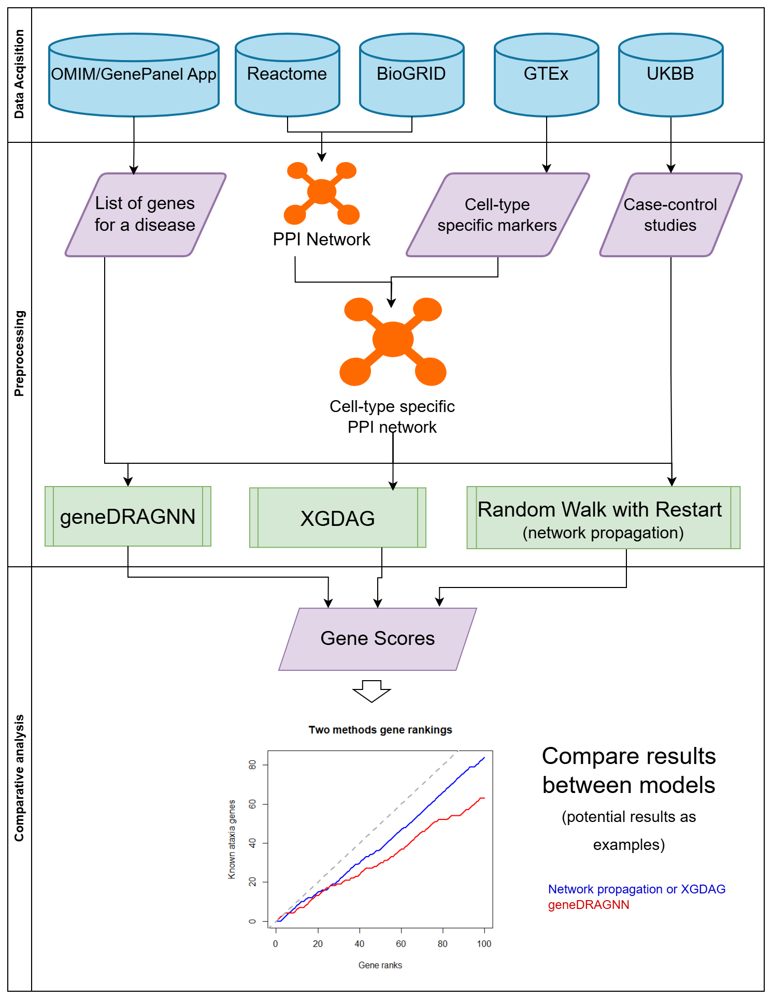\
**Figure Team 1-1.** Overview of Team 1’s gene prioritization workflow using graph neural networks (GNNs).

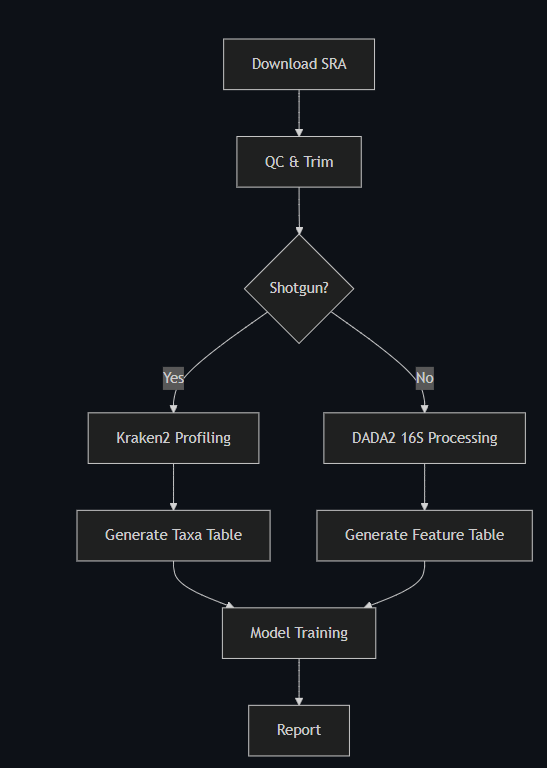\
**Figure Team 2-1.** Overview of Team 2’s microbiome analysis pipeline integrating AI-based interpretation.

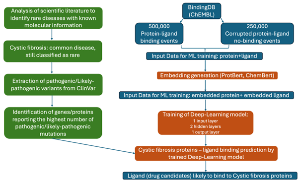\
**Figure Team 4-1.** Overview of Team 4’s AI-driven pipeline for drug target discovery in rare diseases.

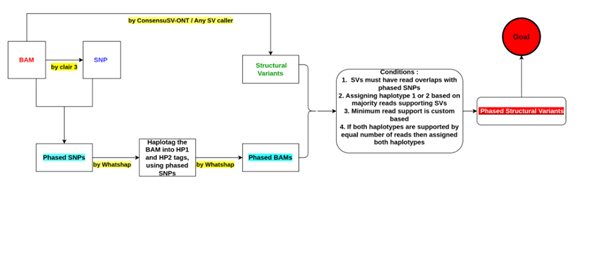\
**Figure Team 5-1.** Overview of Team 5’s structural variant phasing pipeline, SvPhaser.

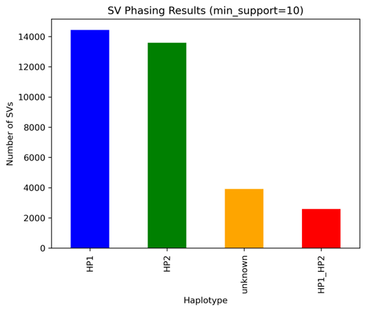\
**Figure Team 5-2.** Data preprocessing and SV discovery module.

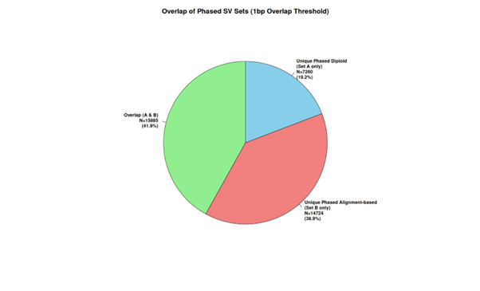\
**Figure Team 5-3.** Phasing and haplotype resolution methodology.

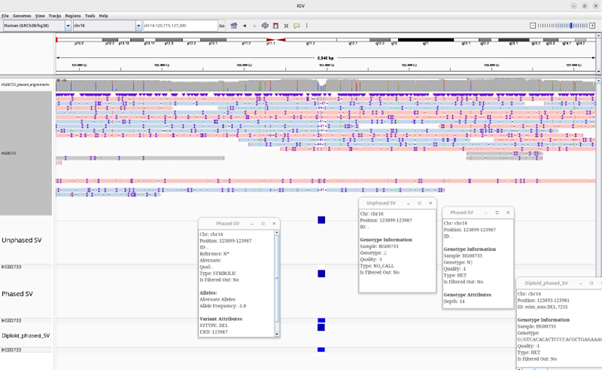\
**Figure Team 5-4.** Visualization interface for phased SVs.

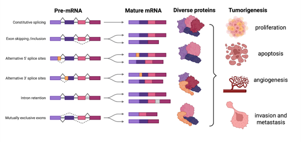\
**Figure Team 6-1.** Introduction – Generic background to alternative splicing.

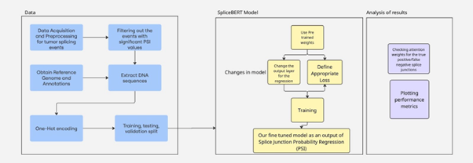\
**Figure Team 6-2.** Methods – Overview of the methodology.

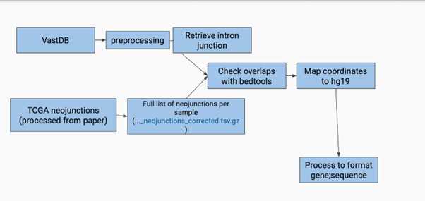\
**Figure Team 6-3.** Methods – Overview of data processing.

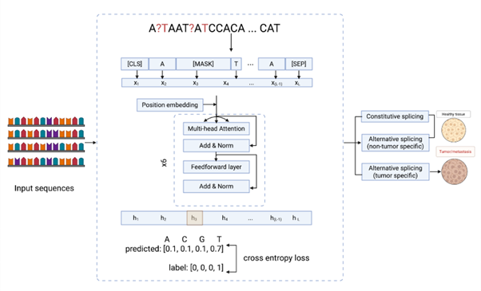\
**Figure Team 6-4.** Results – Alternative splicing model.

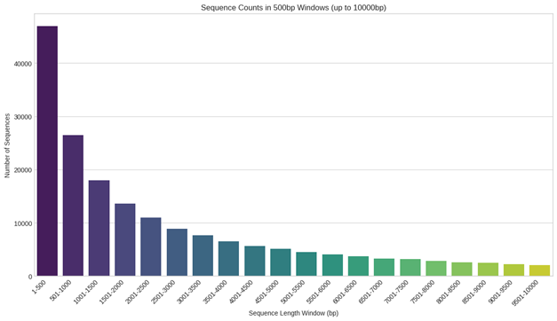\
**Figure Team 6-5.** Results – Sequence length variation.

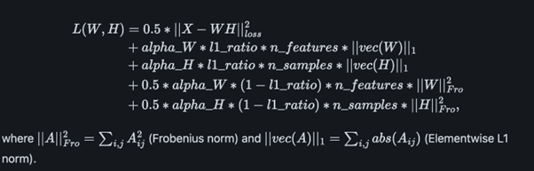\
**Figure Team 7-1.** Overview of Team 7’s EpiXposome framework for integrating epigenomic and exposomic data.

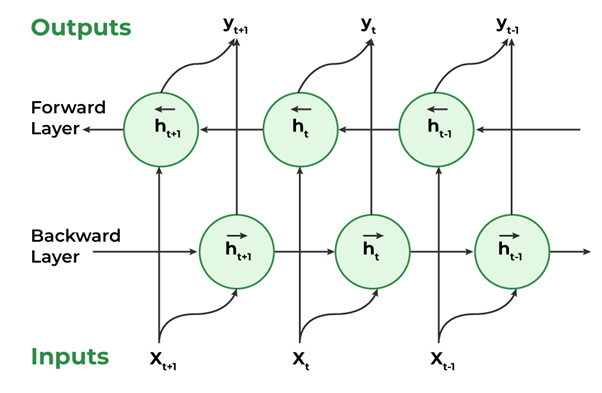\
**Figure Team 7-2.** Epigenomic and exposome data preprocessing.

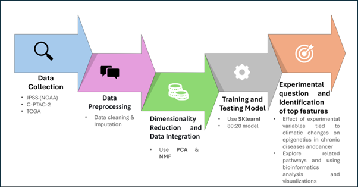\
**Figure Team 7-3.** Machine learning modeling and interpretation phase.

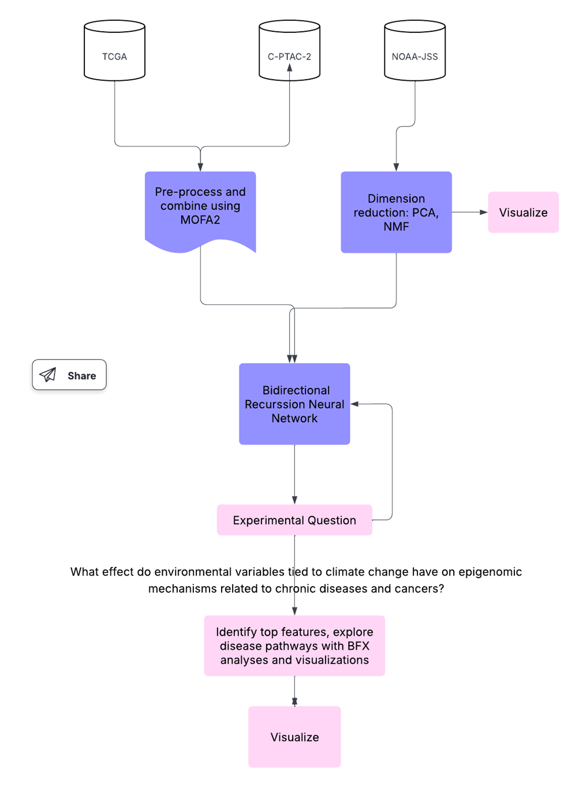\
**Figure Team 7-4.** Visualization and biological insight reporting.

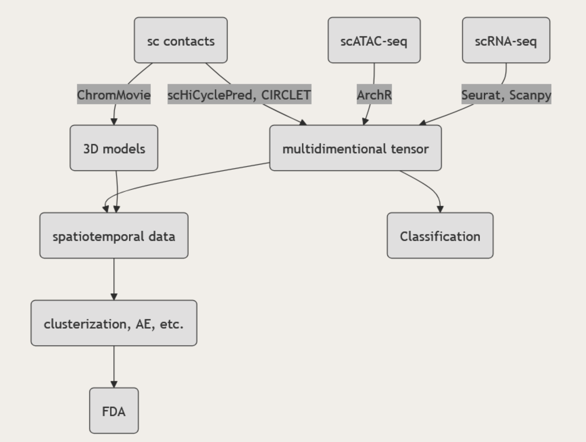\
**Figure Team 8-1.** Overview of Team 8’s phase-specific chromatin state change workflow.

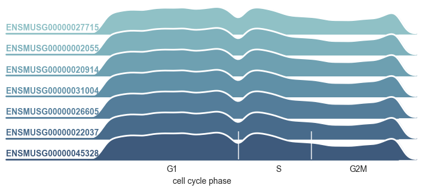\
**Figure Team 8-2.** Gene examples illustrating expression differences across phases.

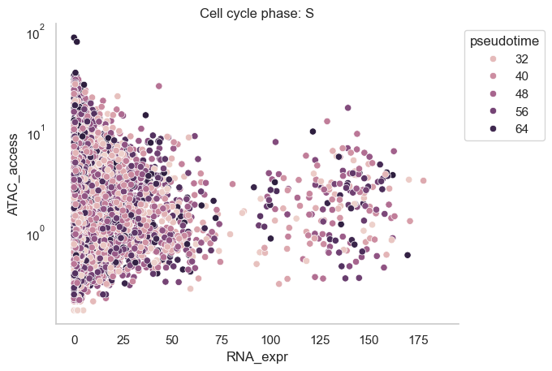\
**Figure Team 8-3A.** Chromatin accessibility vs expression in S phase.

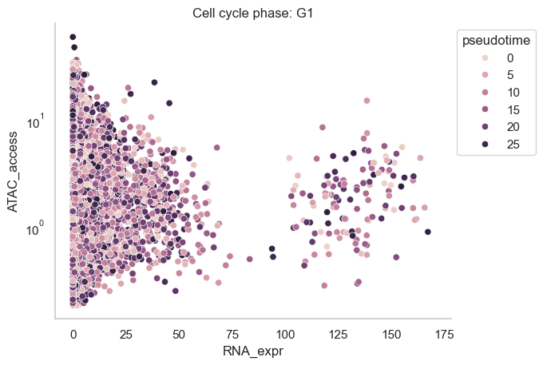\
**Figure Team 8-3B.** Chromatin accessibility vs expression in G1 phase.

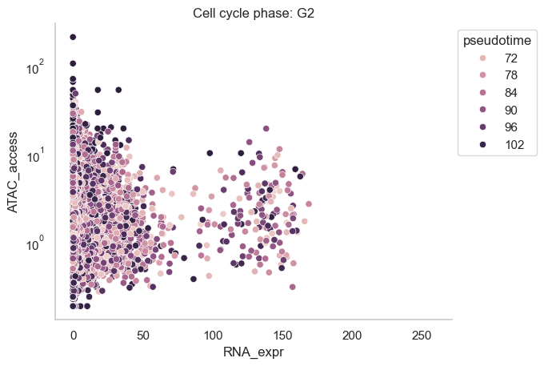\
**Figure Team 8-3C.** Chromatin accessibility vs expression in G2 phase.

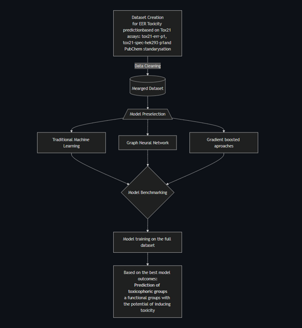\
**Figure Team 9-1.** Overview of Team 9’s AI-powered toxicological profiling pipeline.

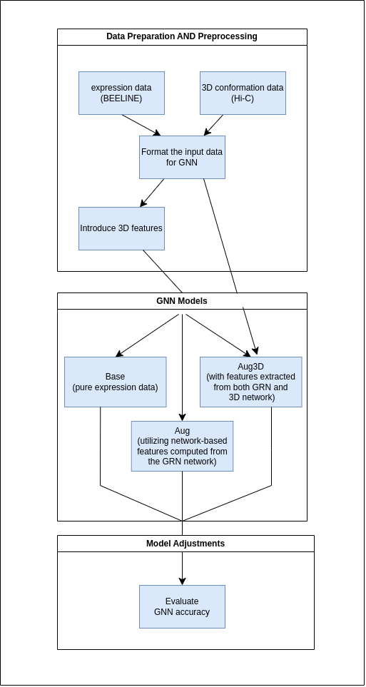\
**Figure Team 10-1.** Workflow of Team 10’s 3D gene regulatory network inference using GNN.

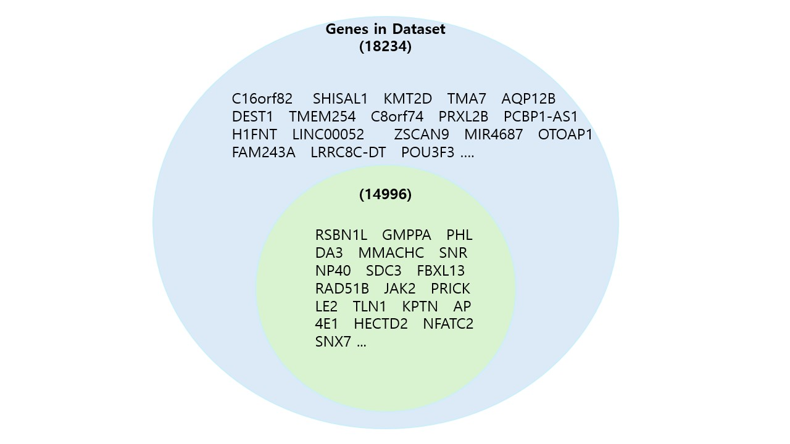\
**Figure Team 10-2.** Comparative visualization of data inputs across multiple configurations.

**Table Team 1-1.** Selected Ataxia-related HPO terms and clinical concepts.

|  HPO Code  | Term Description                                         |
| :--------: | :------------------------------------------------------- |
| HP:0001251 | Ataxia                                                   |
| HP:0002066 | Gait ataxia                                              |
| HP:0002078 | Truncal ataxia                                           |
| HP:0008568 | Vestibular areflexia                                     |
| HP:0002497 | Spastic ataxia                                           |
| HP:0010871 | Sensory ataxia                                           |
| HP:0007221 | Progressive truncal ataxia                               |
| HP:0007240 | Progressive gait ataxia                                  |
| HP:0002073 | Progressive cerebellar ataxia                            |
| HP:0031868 | Optic ataxia                                             |
| HP:0002470 | Nonprogressive cerebellar ataxia                         |
| HP:0002070 | Limb ataxia                                              |
| HP:0002131 | Episodic ataxia                                          |
| HP:0009878 | Cerebellar ataxia associated with quadrupedal gait       |
|  C0007758  | Cerebellar ataxia (UMLS Concept Unique Identifier - CUI) |

**Table Team 1-2.** Comparison of top gene rankings across three methods: geneDRAGNN, retrained geneDRAGNN on ataxia, and MultiXrank.

| geneDRAGNN | retrained geneDRAGNN | MultiXrank |
| :--------- | :------------------- | :--------- |
| MPHOSPH10  | XRCC1                | HDAC3      |
| IMP3       | APBB1                | MLH1       |
| IMP4       | COQ8A                | IL18       |
| RNF146     | HTT                  | ADAM23     |
| F11R       | SPG7                 | ADAM22     |
| PIDD1      | PNKP                 | TLR6       |
| TNKS       | ZFP36                | CD36       |
| F2         | ATXN3                | RBL2       |
| AXIN2      | KCNJ10               | RB1        |
| AXIN1      | VLDLR                | PTPRA      |
| KCNIP3     | GOSR2                | MAPK12     |
| TNKS2      | NF1                  | NFKB1      |
| CRADD      | CASK                 | YOD1       |
| PELP1      | HEXB                 | NPNT       |
| KCND1      | MT-ATP6              | UNC5B      |
| KCNIP4     | COX20                | EYA1       |
| KCNIP1     | POLG                 | GRM5       |
| MAP1LC3B   | TTBK2                | TLE5       |
| NRF1       | GRM1                 | EIF4G1     |
| CASP2      | CP                   | ASAP1      |

**Table Team 5-1.**  The distribution of these phased SVs by haplotype assignment. 

|  HP1  |  HP2  | HP1\_HP2 | Unphased |
| :---: | :---: | :------: | :------: |
| 14439 | 13587 |   2583   |   3914   |

**Table Team 10-1.** The resulting scores of the model. 

| Model |   AUC |  AUPR | F1 score | Jaccard score | Top-k score |
| :---- | ----: | ----: | -------: | ------------: | ----------: |
| Base  | 0.729 | 0.801 |    0.481 |         0.317 |       0.464 |
| Aug   | 0.895 | 0.845 |    0.480 |         0.316 |       0.462 |
| Aug3D | 0.985 | 0.851 |    0.485 |         0.320 |       0.473 |

# Discussion and/or Conclusion

The BioAI Hackathon demonstrated the immense potential of AI methods, particularly graph neural networks, transformer models, and advanced regression architectures for extracting biologically meaningful insights from complex multi-modal datasets. Each team contributed novel workflows and proof-of-concept models that addressed specific biological questions, including gene regulation, splicing, environmental exposures, disease mutation prioritization, and pharmacogenomics. While many of the models require further refinement and validation, especially with larger datasets and external benchmarking, the foundational tools developed here highlight the value of collaborative, time-constrained development in scientific innovation. Teams like Team 1 and Team 10 showed that integrating network topology with domain-specific features can significantly enhance prediction accuracy for gene regulatory or disease-association problems. Similarly, Team 2’s reproducible microbiome pipeline and Team 4’s drug-protein interaction predictor demonstrate translational relevance for agriculture and rare disease drug discovery, respectively. A common thread across projects was the emphasis on reproducibility, extensibility, and transparency, evidenced by the use of well-organised GitHub repositories, containerized workflows, and structured documentation. The challenges faced, such as limited compute resources, software reproducibility issues, and data integration hurdles, offer insight into the current limitations of bioinformatics prototyping under constrained timelines. Moving forward, we encourage sustained collaboration among participants, refinement of the developed tools, and potential publication or deployment of high-impact pipelines. The hackathon served not only as a testing ground for advanced AI in biology but also as a catalyst for building a vibrant, cross-disciplinary community committed to open science and biomedical innovation.

# Future work

Each project developed during this hackathon has laid a strong foundation for continued advancement in rare disease research using artificial intelligence. Future hackathons can build upon these efforts by focusing on: refining model interpretability and transparency; integrating multi-omics and clinically validated data; improving usability through containerization and low-code interfaces; and promoting cross-team modularity, reproducibility, and open dissemination. The sections below outline each team’s forward-looking vision, emphasizing practical next steps and highlighting potential synergies across projects that can guide the next wave of collaborative innovation.

Team 1 focused on gene prioritization with a specific emphasis on ataxia, leveraging graph-based machine learning models such as XGDAG and geneDRAGNN. While they successfully retrained one of the models from the geneDRAGNN tool on an ataxia-specific dataset, their future work aims to further fine-tune the models using disease-specific input data. They also plan to benchmark these models against traditional network propagation methods using leave-one-out cross-validation, comparing the top-ranked gene predictions. For biological interpretability and clinical relevance, they propose employing explainable AI techniques. A key focus is ensuring reproducibility and usability by containerizing the workflow.

Team 4 developed a machine learning framework for drug repurposing in cystic fibrosis, with future plans to extend their work to include graph neural networks for better topological representation of molecular structures. Moreover, to improve model performance, Team4 plans to expand the dataset used for the training of the deep learning model and to increase the epochs included in the training process. They also plan to tailor their models to account for the most frequent protein mutations observed in cystic fibrosis, further anchoring their predictions in real clinical data. Once training is complete, the team envisions deploying an interactive web platform to support non-technical researchers and clinicians in identifying new therapeutic candidates. This commitment to clinical relevance and user-centered design parallels the usability goals highlighted by Team 1 and the data integration strategies proposed by Team 8, opening opportunities for shared infrastructure and downstream deployment across rare disease applications. 

Team 5 worked on assigning haplotypes to structural variants using a deterministic method based on haplotype-tagged read support. Recognizing that this approach can introduce bias, future work will involve refining the method to incorporate percentage-based support metrics, thereby enabling probabilistic haplotype assignment with statistical backing. This direction ensures greater biological relevance and robustness in structural variant interpretation, and complements Team 6’s efforts to bring greater interpretability to sequence-based models by rooting predictions in observable patterns and statistical evidence.

Team 6 focused on distinguishing neojunctions from normal splicing events in cancer using deep learning. Their future directions aim to improve model interpretability by analyzing attention weights to identify motifs or regulatory features near splice sites. They also plan to expand model input windows beyond current size limits to capture more distal regulatory context and to develop holistic event-level models that directly analyze the interplay of exons and introns. These efforts share conceptual ground with Team 5’s commitment to biologically informed modeling, and with Team 1’s interest in expanding graph-level interpretability in disease-specific contexts.

Team 7 proposed packaging their work into a standardized and reusable Python module, enabling wider dissemination and reproducibility. They aim to publish both their findings and the tool itself, providing the broader research community with a usable and well-documented resource. While their scope is focused, the foundational infrastructure they are building can directly support teams such as Team 1 and Team 8, both of which rely on complex, multi-step pipelines that would benefit from standardized packaging and distribution.

Team 8 developed a functional multi-omics integration pipeline incorporating scRNA-seq, scATAC-seq, and scChIA-PET data. They acknowledge the need for deeper validation of their methods and propose to refine feature extraction using tools like CIRCLET and scHiCyclePred for contact data and Seurat or Scanpy for single-cell expression analysis. Future work will explore alternative chromatin representations, including angular relationships, bead positioning, and temporal dynamics derived from functional data analysis. Clustering strategies and latent structure discovery using autoencoders are also of interest. Finally, the team plans to containerize the pipeline as a Python package, which mirrors Team 1’s and Team 4’s emphasis on reproducibility and usability, pointing toward a future in which multi-omic data analysis can be deployed modularly across different disease models.

Team 9 is finalizing their contributions, and their upcoming work is anticipated to complement the directions outlined above—particularly in areas such as network-based modeling, translational utility, or novel data integration strategies. Their future directions will be documented once available, with the expectation of meaningful contributions to the collaborative framework established by other teams.

Team 10 plans to enhance gene network modeling by introducing greater flexibility in architectural configurations and expanding the diversity of networks utilized. They aim to incorporate enhancer data into their models and develop automated tools for 3D network generation. Future work also includes refining negative set construction, performing in-depth evaluations of feature importance, and improving overall usability and configurability of their pipeline. These efforts align with Team 1’s work on GNN-based prioritization and Team 8’s integration of multi-layer network data, contributing toward a unified, graph-based infrastructure for gene–disease exploration.

Together, these future directions define a shared trajectory: toward interpretable, modular, clinically aligned AI tools for rare disease research. By focusing on data integration, biological realism, usability, and reproducibility, future hackathons can evolve into accelerators for translational research. Building interoperable pipelines, benchmarking across tools, and fostering cross-team collaboration will be essential to realizing this collective vision. 

# Acknowledgements

This work was done at the BioAI Hackathon at the Centre of New Technologies, University of Warsaw.  

BB is a full-time employee of NVIDIA. Halina Krzystek is a full-time employee of IQVIA Laboratories, USA. JK is supported by the France 2030 state funding managed by the National Research Agency with the reference "ANR-22-PEPRSN-0013". Aleksandra Sobieska acknowledges the support of Helmholtz Center Munich, where she was affiliated as a visiting researcher at the time of the hackathon. Rishika Gupta was affiliated as a full-time researcher at CiTIUS (Centro Singular de Investigación en Tecnoloxías Intelixentes), Spain during the days of the hackathon. SFGLab team is supported by Warsaw University of Technology within the Excellence Initiative: Research University (IDUB) programme and co-supported by Polish National Science Centre (2020/37/B/NZ2/03757). The work was co-supported by National Institute of Health USA 4DNucleome grant 1U54DK107967-01 and “Nucleome Positioning System for Spatiotemporal Genome Organization and Regulation”.

# References
